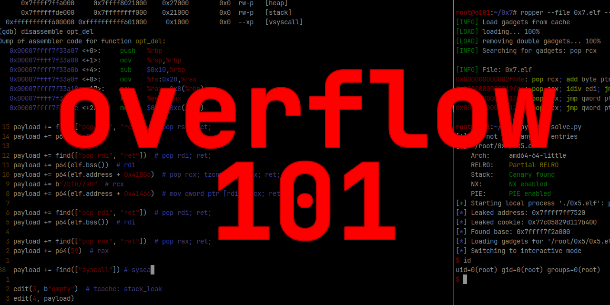

<h1 align="center">
  
   
  o101 | Bellek taşmalarını öğrenin
</h1>

o101, yani overflow 101 size bellek taşmalarını (memory overflow) öğretecek 
ve pratik yapmanızı sağlayacak küçük bir rehber.

## Başlarken...
Mümkün olduğunca erkenden belirtmek isterim ki bu kaynak herkes için uygun
olmayabilir - hayır RTÜK projeyi sansürlemedi - **biraz ön bilgiye ihtiyacınız olacak**,
o anlamda dedim.

- **Zorunlu:** Bu kaynağı doğru şekilde kullanabilmek ve anlamak için aşağıdakilere ihtiyacınız olacak:
    * Temel linux bilgisi
    * Genel bellek yönetimi (stack, heap vs)
    * Genel low level program akışı (özellikle `ret` yapısı, [bunu inceleyin](https://youtu.be/e46wHUjNDjE))
    * Birazcık C bilgisi
    * Lab için QEMU/KVM kurulumu

- **Opsiyonel:** Bunun dışında aşağıdakileri biliyorsan bu kaynağı takip etmen çok daha kolay olur:
    * Birazcık python bilgisi
    * tmux deneyimi/bilgisi
    * GDB deneyimi/bilgisi

### Bir sorun mu var? 
Eğer yardıma ihtiyaç duyarsanız, herhangi bir sorun yaşarsanız
bir [issue oluşturmaktan çekinmeyin](https://github.com/ngn13/o101/issues)

Sorularınız varsa ve doğrudan iletişime geçmek istiyorsanız [bu XMPP sohbet odasına](xmpp:penguintux@conference.jabbers.one)
katılabilirsiniz

### Hazır mısın?
Herşey tamamsa, aşağıdaki linkleri kullanarak macerana başlayabilirsin.

İyi eğlenceler!

| Bölüm           | Açıklama                                                  | Link                        |
| --------------- | --------------------------------------------------------- | --------------------------- |
| Kurulum         | Pratik ortamını nasıl kuracağınızı öğrenin                | [setup.md](docs/setup.md)   |
| 0x0             | İlk pratik! Dönüş adresi ile programın akışını değiştirin | [0x0.md](docs/0x0.md)       |
| 0x1             | Stack üzerinde shellcode çalıştırın                       | [0x1.md](docs/0x1.md)       |
| 0x2             | ret2libc ve ROP ile NX bellek korumasını bypass edin      | [0x2.md](docs/0x2.md)       |
| 0x3             | Format metinleri ile stack çerezlerini leakleyin          | [0x3.md](docs/0x3.md)       |
| 0x4             | glibc'den adres leakleyerek ASLR kırın                    | [0x4.md](docs/0x4.md)       |
